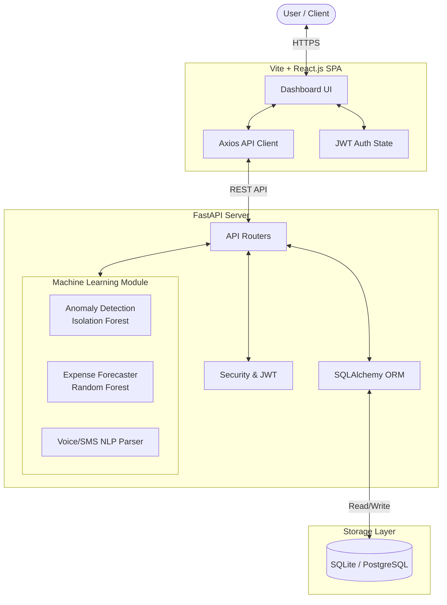

# AI-Powered Personal Finance Intelligence System (PFIS)

**🟢 Live Demo:** [View Application](https://ai-powered-personal-finance-intelligence-system-6zaz4oc78.vercel.app/)

[](https://fastapi.tiangolo.com/)
[](https://reactjs.org/)
[](https://scikit-learn.org/)
[](https://www.docker.com/)

> **Project Vision**: "We are not building an expense tracker. We are building an AI-powered financial decision support system."

---

## 🎯 What is this project?
PFIS is a modern, full-stack intelligence platform that goes beyond simple expense logging. It actively monitors your financial behavior, analyzes spending patterns, and uses Machine Learning to give actionable insights, budget alerts, and fraud detection. 

## ❓ Why did we build it?
Traditional budgeting apps only look at the **past**—they tell you where your money *went*. PFIS looks at the **present and future**. By integrating AI, we can:
- Stop you *before* you overspend by forecasting end-of-month expenses.
- Detect unusual transactions (fraud/anomalies) in real-time.
- Remove manual data entry via Voice Assistants and SMS Auto-detection.

## ⚙️ How does it work?
The system utilizes a modern decouple architecture:
- **Frontend (React + Vite)**: A dynamic, highly responsive dashboard with real-time charts (Chart.js) and alerts.
- **Backend (FastAPI)**: A high-performance Python backend handling REST API requests, database ORM operations, and authentication.
- **AI/ML Engine**: Scikit-Learn models trained on synthetic transaction data are loaded into memory for real-time anomaly scoring (Isolation Forest) and forecasting (Random Forest).

---

## 🏗️ System Architecture & Flowchart



---

## 🚀 Key Features

1. **AI Expense Forecasting (ML Module)**:
   - Uses Scikit-Learn & Random Forest Regressors to predict category-wise next month expenses.
   - Calculates confidence scores, trend direction, and budget depletion velocity.

2. **Real-Time Fraud & Anomaly Detection**:
   - Hybrid Isolation Forest machine learning algorithm + contextual heuristic scoring (Transaction Amount, Time of day, Unregistered Location, New Device).
   - Generates Risk Scores (Low, Medium, High) with explicit detection reasons.

3. **Spending Habit Persona Classifier**:
   - Classifies user behavior into personas: `Food Lover`, `Heavy Shopper`, `Weekend Spender`, `Disciplined Saver`, `High Entertainment Spender`.

4. **Dynamic AI Recommendation Engine**:
   - Generates personalized, explainable savings advice and estimated monthly savings targets.

5. **Category-wise Budget Management**:
   - Real-time progress bars, budget utilization percentages, and over-budget alert status (`Safe`, `Warning`, `Exceeded`).

6. **Financial Reports & PDF Export**:
   - Downloadable print-ready PDF reports containing monthly summaries, category spend distribution, and budget compliance tables.

7. **Voice Commands & SMS Auto-Detection**:
   - Add expenses simply by saying "I spent 500 on groceries today".
   - Automatically parse banking SMS formats.

---

## 💻 Tech Stack

- **Backend**: FastAPI (Python 3.11), SQLAlchemy ORM, Pydantic v2, Pytest, ReportLab
- **Database**: SQLite (dev) / PostgreSQL (production-ready)
- **Frontend**: React, Vite, Tailwind CSS, Lucide Icons, Recharts, Chart.js, Axios
- **Machine Learning**: Scikit-Learn (RandomForestRegressor, IsolationForest), Pandas, NumPy, XGBoost
- **Deployment**: Vercel (Frontend), Render (Backend), Docker Compose

---

## 🛠️ Quick Start Guide

### 1. Local Development Setup

#### Backend:
```bash
cd backend
python -m venv venv
# On Windows:
venv\Scripts\activate
# On Mac/Linux:
source venv/bin/activate

pip install -r requirements.txt
uvicorn main:app --reload --port 8000
```
*API Documentation (Swagger UI) available at: `http://localhost:8000/docs`*

#### Frontend:
```bash
cd frontend
npm install
npm run dev
```
*Web Application UI available at: `http://localhost:5173`*

---

## ☁️ Deployment Ready

This repository is pre-configured for modern PaaS deployment:
- **Render (`render.yaml`)**: Connect your GitHub to Render.com and deploy the backend instantly. 
- **Vercel (`vercel.json`)**: Import the `frontend` folder to Vercel for seamless SPA deployment. (Set `VITE_API_URL` to your Render backend URL).

---

## 📄 License & Credits
Developed as an industry-grade graduation project for AI-Driven Personal Finance Intelligence.
